# Apartment Price Predictor


## Project Overview

This project builds a complete end-to-end Machine Learning pipeline for predicting apartment prices in Hyderabad using supervised learning techniques.

The project includes:

* Exploratory Data Analysis (EDA)
* Data preprocessing pipelines
* Linear regression models
* Tree-based ensemble models
* Premium apartment classification
* Model evaluation and comparison
* Feature importance analysis
* Inference pipeline for real-world prediction
* Model serialization using joblib

The objective is to create a production-style ML workflow instead of a notebook-only experiment.

---

# Dataset

Dataset Source:

* Indian House Price Combined Dataset from Kaggle

Features include:

* Apartment area
* Number of bedrooms
* Location
* Geolocation coordinates
* Amenities and facilities
* Security and furnishing features
* Lifestyle features
* Explainable AI using SHAP

Dataset Size:

* 2276 apartment listings

Target Variable:

* `price`

---

# Project Structure

```text
Apartment-Price-Predictor/
│
├── data/
│   ├── raw/
│   └── processed/
│
├── notebooks/
│   ├── 01_eda.ipynb
│   ├── 02_linear_models.ipynb
│   ├── 03_tree_models.ipynb
│   ├── 04_classification.ipynb
│   ├── 05_inference_and_export.ipynb
│   └── 06_shap_explainability.ipynb
│
├── models/
│   ├── linear_regression.pkl
│   ├── ridge_regression.pkl
│   ├── lasso_regression.pkl
│   ├── decision_tree.pkl
│   ├── random_forest.pkl
│   └── premium_classifier.pkl
│
├── images/
├── reports/
├── src/
│   ├── __init__.py
│   └── inference.py
│
├── README.md
├── requirements.txt
└── .gitignore
```

---

# Exploratory Data Analysis

## Price Distribution

The apartment prices show a right-skewed distribution, which is common in real-estate datasets due to luxury apartment outliers.

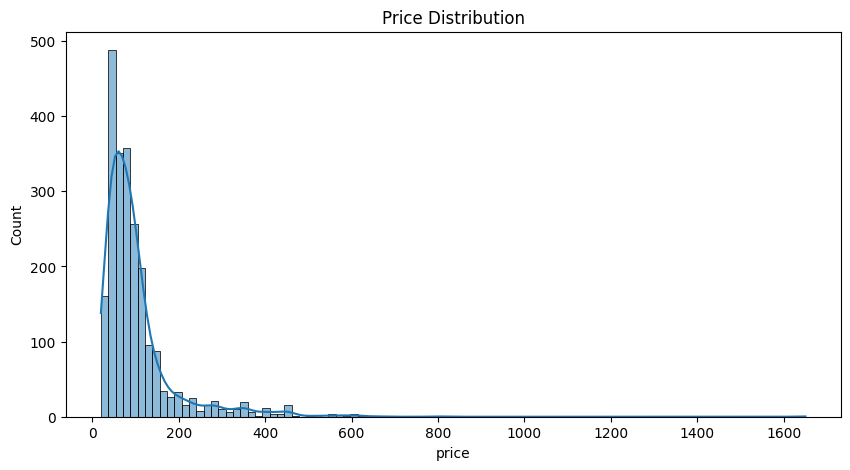

---

## Correlation Heatmap

The strongest correlations with apartment price were:

* Area
* Number of bedrooms
* Geolocation features
* Premium amenities

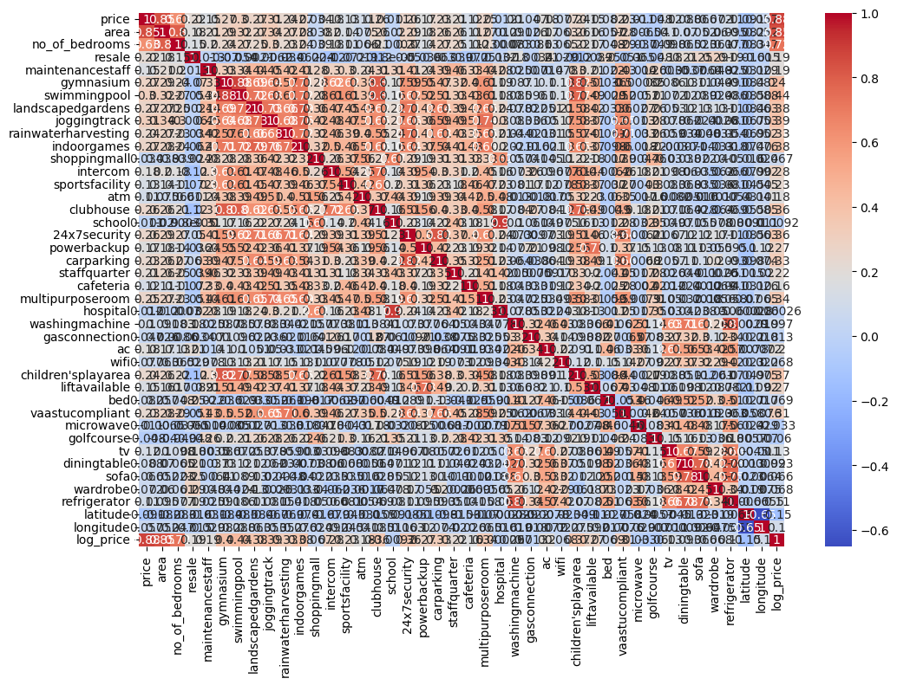

---

## Outlier Analysis

Luxury apartments created several high-value outliers in the dataset.

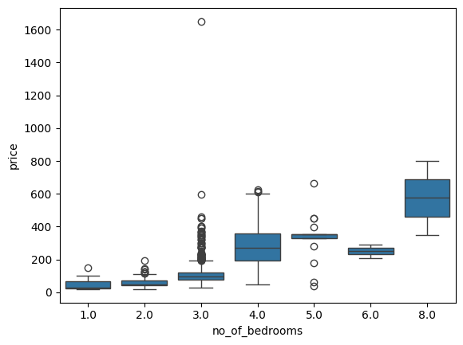

---

# Machine Learning Pipeline

The preprocessing pipeline was built using:

* `Pipeline`
* `ColumnTransformer`
* `StandardScaler`
* `OneHotEncoder`
* `SimpleImputer`

The workflow ensures:

* Consistent preprocessing
* Prevention of data leakage
* Reusable deployment-ready pipelines

---

# Models Trained

## Regression Models

* Linear Regression
* Ridge Regression
* Lasso Regression
* Decision Tree Regressor
* Random Forest Regressor

---

## Classification Model

Premium apartment classifier:

* Random Forest Classifier

Classification target:

```python
premium = price > median_price
```

---

# Model Evaluation Metrics

## Regression Metrics

* RMSE
* MAE
* R² Score

---

## Classification Metrics

* Accuracy
* Precision
* Recall
* F1 Score
* ROC AUC
* Precision-Recall Curve

---

# Model Comparison

Replace the values below with your actual results.

| Model             | RMSE | MAE  | R²   |
| ----------------- | ---- | ---- | ---- |
| Baseline          | 0.61 | 0.70 | 0.00 |
| Linear Regression | 0.22 | 0.15 | 0.88 |
| Ridge Regression  | 0.21 | 0.15 | 0.89 |
| Lasso Regression  | 0.28 | 0.21 | 0.82 |
| Decision Tree     | 0.23 | 0.15 | 0.87 |
| Random Forest     | 0.18 | 0.11 | 0.92 |

---

# Residual Analysis

Residual analysis was performed to evaluate:

* Nonlinearity
* Heteroscedasticity
* Outliers
* Model assumptions

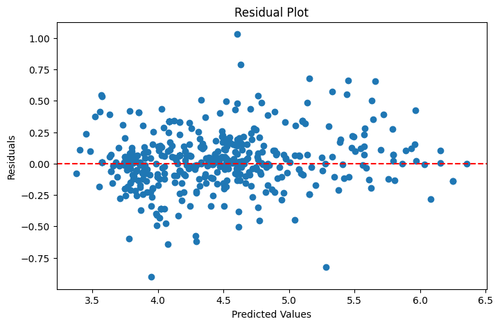

---

# Actual vs Predicted

This plot compares predicted apartment prices against actual prices.

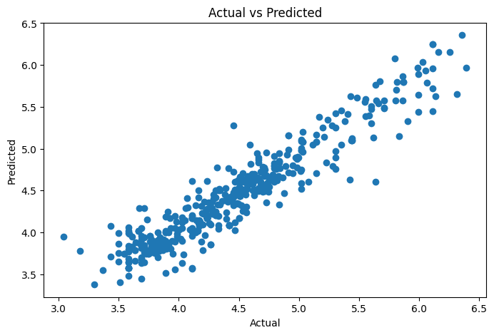

---

# Feature Importance

Random Forest feature importance analysis showed that the most influential features were:

* Area
* Latitude
* Longitude
* Bedroom count
* Premium amenities
* Location-based signals

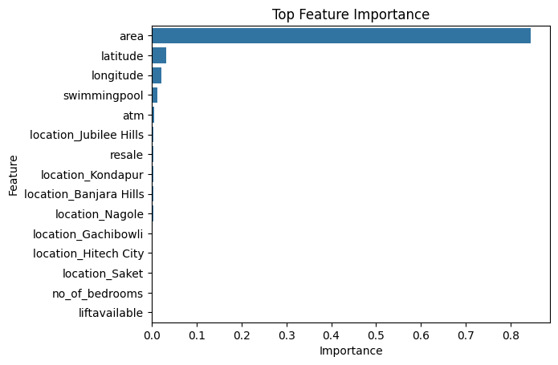

---

---

# Explainable AI with SHAP

SHAP (SHapley Additive exPlanations) was used to interpret the Random Forest apartment price prediction model.

The explainability workflow included:

- global feature importance analysis
- local prediction explanations
- directional feature contribution analysis
- interpretable model behavior visualization

SHAP improves model transparency and helps explain how apartment features influence predicted prices.

---

# SHAP Summary Plot

The SHAP summary plot shows the global importance and directional impact of features across all apartment predictions.

- Red points represent high feature values
- Blue points represent low feature values
- Features further right increase predicted price
- Features further left decrease predicted price

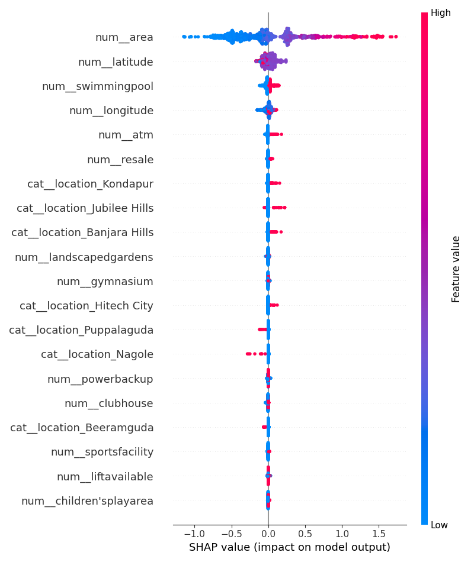

---

# Local Prediction Explanation

Local SHAP explanations show how individual apartment features contributed to a specific prediction.

This helps explain:

- why a particular apartment received a high prediction
- which features increased value
- which features reduced value

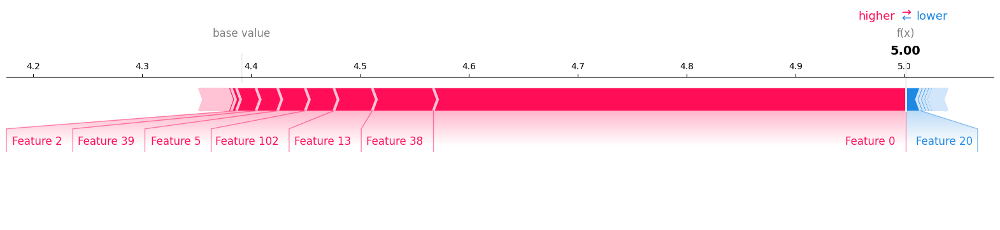

---

# SHAP Insights

Key explainability findings:

- Apartment area strongly increased predicted prices.
- Premium geolocations had major positive contributions.
- Luxury amenities positively influenced valuation.
- Latitude and longitude captured important real-estate market segmentation patterns.
- Larger apartments consistently pushed predictions upward.

---

# Learning Curve Analysis

Learning curves were used to analyze:

* Bias
* Variance
* Overfitting
* Generalization capability

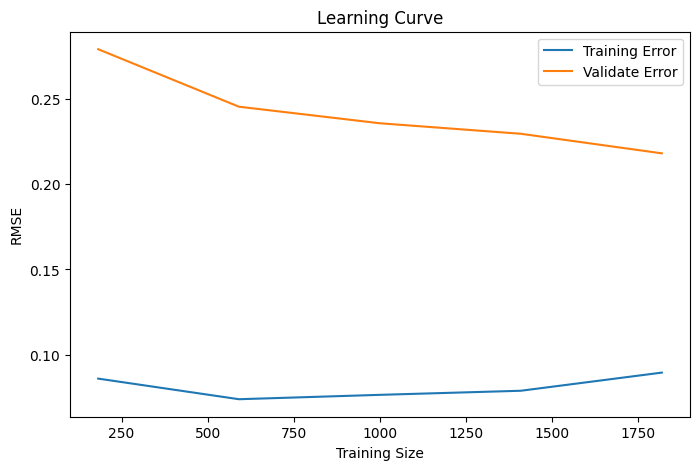

---

# Classification Evaluation

## Confusion Matrix

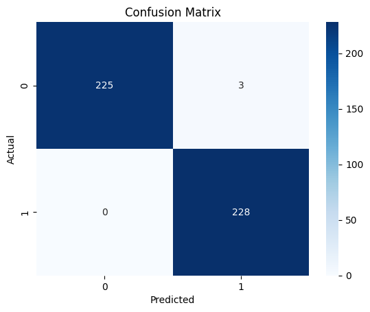

---

## ROC Curve

ROC AUC analysis measured classifier separability across thresholds.

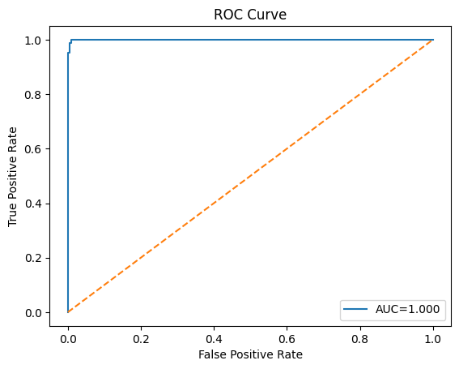

---

## Precision-Recall Curve

PR curves were used because they are more informative for imbalanced classification problems.

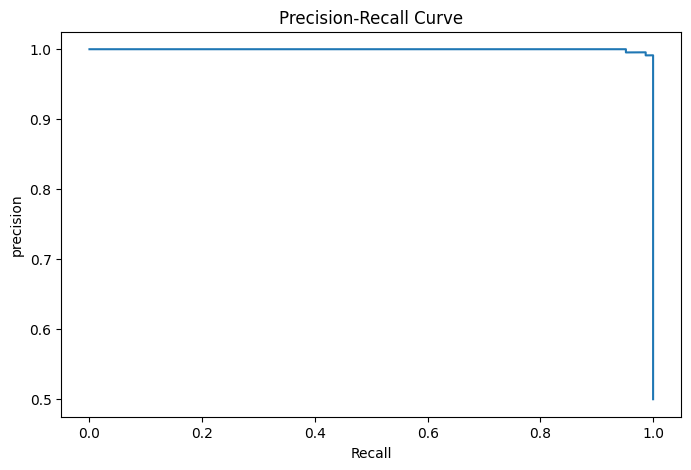

---

# Inference Pipeline

The trained Random Forest pipeline was serialized using `joblib`.

Inference function:

```python
from src.inference import clean_and_predict
```

Example usage:

```python
sample_apartment = {

    "area": 1400,

    "location": "Gachibowli",

    "no_of_bedrooms": 3,

    "resale": 1,

    "maintenancestaff": 1,

    "gymnasium": 1,

    "swimmingpool": 1,

    "landscapedgardens": 1,

    "joggingtrack": 1,

    "rainwaterharvesting": 1,

    "indoorgames": 1,

    "shoppingmall": 1,

    "intercom": 1,

    "sportsfacility": 1,

    "atm": 1,

    "clubhouse": 1,

    "school": 1,

    "24x7security": 1,

    "powerbackup": 1,

    "carparking": 1,

    "staffquarter": 0,

    "cafeteria": 1,

    "multipurposeroom": 1,

    "hospital": 1,

    "washingmachine": 1,

    "gasconnection": 1,

    "ac": 1,

    "wifi": 1,

    "children'splayarea": 1,

    "liftavailable": 1,

    "bed": 1,

    "vaastucompliant": 1,

    "microwave": 1,

    "golfcourse": 0,

    "tv": 1,

    "diningtable": 1,

    "sofa": 1,

    "wardrobe": 1,

    "refrigerator": 1,

    "city": "Hyderabad",

    "latitude": 17.4401,

    "longitude": 78.3489
}

prediction = clean_and_predict(sample_apartment)

print(prediction)
```

---

# Installation

## Clone Repository

```bash
git clone https://github.com/MohammedMateen0/Apartment-Price-Predictor.git
```

---

## Install Dependencies

```bash
pip install -r requirements.txt
```

---

## Run Jupyter Notebook

```bash
jupyter notebook
```

---

# requirements.txt

```text
pandas
numpy
matplotlib
seaborn
scikit-learn
joblib
jupyter
```

---

# Key Learning Outcomes

This project demonstrates:

* Supervised Machine Learning
* End-to-end ML pipelines
* Regression modeling
* Classification modeling
* Feature engineering
* Cross-validation
* Threshold tuning
* Model evaluation
* Feature importance analysis
* Inference system design
* Production-style project organization
* Explainable AI (XAI)
* SHAP feature attribution
* Model interpretability

---

# Future Improvements

Potential upgrades:

* XGBoost
* LightGBM
* Hyperparameter tuning
* Advanced SHAP interaction analysis
* Streamlit deployment
* FastAPI deployment
* Docker containerization
* CI/CD integration
* Cloud deployment

---

# Author

Mohammed Mateen

Machine Learning & Data Science Portfolio Project

---
